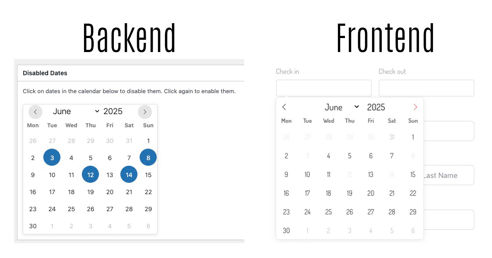

# Global Date Blocker for Fluent Forms

Global Date Blocker enhances your Fluent Forms by allowing administrators to globally disable specific dates and enabling dynamic date range selections (like check-in/check-out) with intelligent restrictions.

## Background & Motivation

This plugin was born from a real client need: **globally restricting certain dates like holidays** across booking forms. Initially, I was implementing this functionality directly in the Fluent Forms datepicker field, but this approach wasn't viable for scalable, maintainable solutions.

The client needed a way to easily mark holidays and other unavailable dates that would automatically be respected across their booking system. Rather than modifying each form individually or hardcoding restrictions, this plugin provides a centralized solution that works seamlessly with Fluent Forms.

## Overview

Managing availability for bookings, appointments, or any date-sensitive form can be challenging. This plugin simplifies the process by providing:

1.  **Global Date Management**: An admin interface to select dates (e.g., holidays, booked-out days) that should be unavailable across designated Fluent Forms.
2.  **Dynamic Date Range**: Functionality for two date fields (e.g., Check-in and Check-out) where selecting a date in one field intelligently restricts the available dates in the other. For instance, the check-out date cannot be before the check-in date, and the range respects any globally disabled dates.

This plugin is designed to work seamlessly with Fluent Forms. It specifically looks for Fluent Forms wrapped by BricksExtras (`fluentform_wrapper_{form_id}`) first, and then falls back to the standard Fluent Forms selector (`fluentform_{form_id}`) if the wrapper isn't found. This ensures compatibility whether you're using BricksExtras or implementing Fluent Forms directly.

## Key Features

*   **Visual Admin Calendar**: Easily select and manage globally disabled dates using an intuitive Flatpickr calendar in the WordPress admin.
*   **Configurable Form Targeting**: Specify which Fluent Form (by ID) and which date fields (by their `name` attribute) the plugin should interact with.
*   **Dynamic Check-in/Check-out Logic**:
    *   Check-out date automatically restricted to be after the selected Check-in date.
    *   Check-in date automatically restricted to be before the selected Check-out date.
    *   The selectable range for the Check-out date is dynamically limited by the next globally disabled date after the Check-in date.
*   **BricksExtras Compatibility**: Prioritizes selectors for Fluent Forms integrated via BricksExtras, with a fallback for direct Fluent Forms implementations.
*   **Clear Date Buttons**: Adds "X" buttons to date fields for easy clearing of selected dates.
*   **Lightweight and Efficient**: Frontend JavaScript is optimized for performance.
*   **Developer-Friendly**: Built with WordPress best practices, clean code, and a structured approach.
*   **Open Source**: MIT Licensed, ready for you to fork and customize!

## Screenshots

1.  **Admin Settings Page**: Configure target form, field names, and select globally disabled dates.
    
    

2.  **Frontend Form in Action**: A Fluent Form showing the date pickers with disabled dates and date range logic.
    
    

## Requirements

*   WordPress 5.0 or higher
*   PHP 7.4 or higher (PHP 8.0 recommended as per your `booking-restrict.php`)
*   Fluent Forms (Pro version recommended for full compatibility, tested with 6.0.3+)
*   jQuery (comes with WordPress)

## Installation

1.  **Download**: Download the plugin `.zip` file from the [GitHub repository releases page](https://github.com/wunderlandmedia/global-date-blocker/releases) or clone the repository.
2.  **Upload**:
    *   Via WordPress Admin: Go to `Plugins` > `Add New` > `Upload Plugin`. Choose the downloaded `.zip` file and click `Install Now`.
    *   Via FTP: Extract the `.zip` file and upload the `booking-restrict` folder to your WordPress `wp-content/plugins/` directory.
3.  **Activate**: Go to `Plugins` in your WordPress admin and activate "Global Date Blocker".
4.  **Configure**: Navigate to `Settings` > `Global Date Blocker` to set up the plugin.

## Configuration

After installation and activation, you need to configure the plugin to target your specific Fluent Form and its date fields.

### 1. Plugin Settings Page

Navigate to **WordPress Admin > Settings > Global Date Blocker**.

*   **Target Form ID**: Enter the numerical ID of the Fluent Form you want this plugin to affect.
*   **Check-in Field Name**: Enter the `name` attribute of your check-in date input field in the Fluent Form (e.g., `checkin`, `start_date`).
*   **Check-out Field Name**: Enter the `name` attribute of your check-out date input field in the Fluent Form (e.g., `checkout`, `end_date`).
*   **Select Disabled Dates**: Use the inline calendar to click on dates you want to disable globally. Click again to deselect. These dates will be unselectable on the frontend.
*   **Save Settings**: Click the "Save Settings" button.

### 2. Fluent Forms Field Setup

1.  Go to **Fluent Forms Pro** and edit the form you specified by its ID in the plugin settings.
2.  Ensure you have two "Date / Time" input fields in your form.
    *   One for the check-in date.
    *   One for the check-out date.
3.  For each of these date fields:
    *   Open the field's "Input Customization" settings.
    *   Set the **Name Attribute** to exactly match what you entered in the plugin's "Check-in Field Name" and "Check-out Field Name" settings. This is crucial for the plugin to identify the correct fields.
4.  Save your Fluent Form.

## How It Works

### Admin Side

*   The plugin provides a settings page under "Settings > Global Date Blocker".
*   Administrators can specify the target Fluent Form ID, and the `name` attributes for the check-in and check-out date fields.
*   A Flatpickr calendar allows admins to select multiple dates. These selected dates are saved as an array of 'YYYY-MM-DD' strings in the WordPress options database.

### Frontend Side

The core logic resides in `assets/js/gdb-frontend.js`:

1.  **Data Localization**: The plugin uses `wp_localize_script` to pass the array of globally disabled dates, the target form ID, and the check-in/check-out field names to the frontend JavaScript.
2.  **Form Identification**:
    *   The script first attempts to find the Fluent Form using a selector common with BricksExtras: `.fluentform_wrapper_{formId}`.
    *   If not found, it falls back to the standard Fluent Forms selector: `.fluentform_{formId}`.
3.  **Date Picker Initialization**:
    *   If the target form and the specified check-in/check-out input fields (matched by their `name` attribute) are found, the script initializes Flatpickr instances for them.
4.  **Applying Global Restrictions**: Both date pickers are configured to disable:
    *   Any dates explicitly selected as "disabled" in the admin settings.
    *   Dates before "today".
5.  **Check-in Date Logic**:
    *   When a user selects a check-in date:
        *   The **Check-out picker's `minDate`** is set to the day *after* the selected check-in date.
        *   The **Check-out picker's `maxDate`** is determined by finding the *next globally disabled date* that occurs *after* the selected check-in date. If such a date exists, the `maxDate` for the check-out picker is set to the day *before* this next disabled date. If no such intervening disabled date is found, the check-out picker has no upper `maxDate` restriction (other than future disabled dates).
        *   If the currently selected check-out date becomes invalid (e.g., it's now before the new `minDate` or after the new `maxDate`), it is cleared.
6.  **Check-out Date Logic**:
    *   When a user selects a check-out date:
        *   The **Check-in picker's `maxDate`** is set to the day *before* the selected check-out date.
        *   If the currently selected check-in date becomes invalid, it is cleared.
7.  **Clear Buttons**: Small "X" buttons are added next to each date input, allowing users to easily clear their selection.

## Future Development Ideas

**Current Scope**: This plugin currently targets a single Fluent Form, which meets the immediate client need.

**Potential Enhancements**: Future development could include:

*   **Multiple Form Support with Custom Post Types**: Implement a custom post type solution to create multiple instances of date blockers, each targeting different Fluent Forms. This would enable an Airbnb-like solution where administrators could:
    *   Manage multiple properties/rooms with individual availability calendars
    *   Set specific restrictions per room or property type
    *   Have granular control over what's available for different booking objects
*   **Single Date Range Field**: Revamp the selection to use a single Fluent Forms field that opens a date range picker, simplifying the user interface.
*   **Recurring Date Rules**: Add options to disable recurring dates (e.g., all weekends, specific days of the week).
*   **Improved UI for Admin**: Enhanced admin interface for managing dates and settings.

Since this is MIT licensed, you're free to fork and extend the functionality to meet your specific needs!

## Contributing

This is an open-source project under the MIT License. Contributions are welcome!

1.  **Fork** the repository on GitHub.
2.  **Create a new branch** for your feature or bug fix.
3.  **Make your changes** and commit them with clear, descriptive messages.
4.  **Push** your changes to your fork.
5.  **Submit a Pull Request** to the main repository.

Please ensure your code adheres to WordPress coding standards.

Since this project uses the MIT License, you're also free to fork it and create your own version without contributing back - though contributions are always appreciated!

## License

This plugin is licensed under the **MIT License**.
See the [LICENSE](LICENSE) file for more details.

## Support

If you encounter any issues or have questions, please use the [GitHub Issues tracker](https://github.com/wunderlandmedia/global-date-blocker/issues).